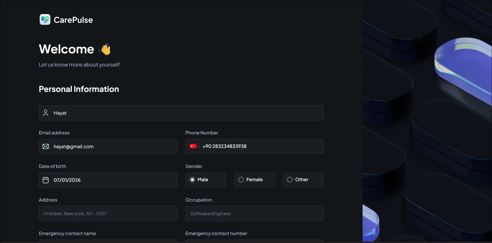
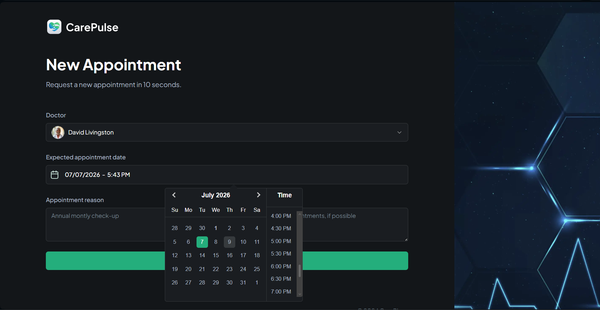
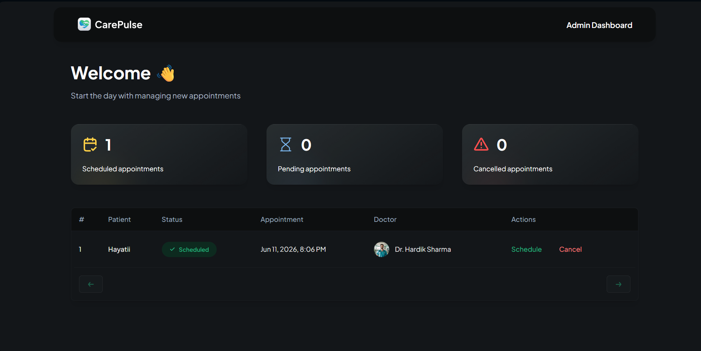

# 🏥 CarePulse

CarePulse is a modern healthcare management system built with **Next.js 14**, **TypeScript**, **TailwindCSS**, **Shadcn UI**, **Radix**, and **MongoDB**.  
It streamlines patient registration, appointment scheduling, and medical record management while integrating secure authentication and real‑time notifications.

---

## ✨ Features

- 🔐 **Secure Authentication** – Role-based access for patients, doctors, and admins.  
- 📋 **Patient Registration** – Easy onboarding with validated forms.  
- 📅 **Appointment Scheduling** – Book, reschedule, and cancel appointments seamlessly.  
- 📂 **Medical Record Management** – Store and retrieve patient history securely.  
- 🔔 **Real-Time Notifications** – Instant updates for appointments and system alerts.  
- 🎨 **Modern UI** – Built with Shadcn UI + Radix for accessibility and TailwindCSS for responsive design.  
- ⚡ **Performance** – Optimized with Next.js 14 server components and TypeScript type safety.  

---

## 🛠️ Tech Stack

| Technology   | Purpose |
|--------------|---------|
| Next.js 14   | Full-stack React framework |
| TypeScript   | Type safety & maintainability |
| TailwindCSS  | Utility-first styling |
| Shadcn UI    | Accessible UI components |
| Radix        | Headless UI primitives |
| MongoDB      | Database for patient records & appointments |

---
## 📸 Screenshots

### 1. Patient Registration Form


### 3. Appointment Scheduling Modal


### 4. Medical Records Dashboard


### 5. Admin Panel


### 6. Authentication Flow (Login/Signup)


### 7. Real-Time Notifications UI


## 🚀 Getting Started

### 1. Clone the repository
```bash
git clone https://github.com/faisalalsalih/carepulse.git
cd carepulse
